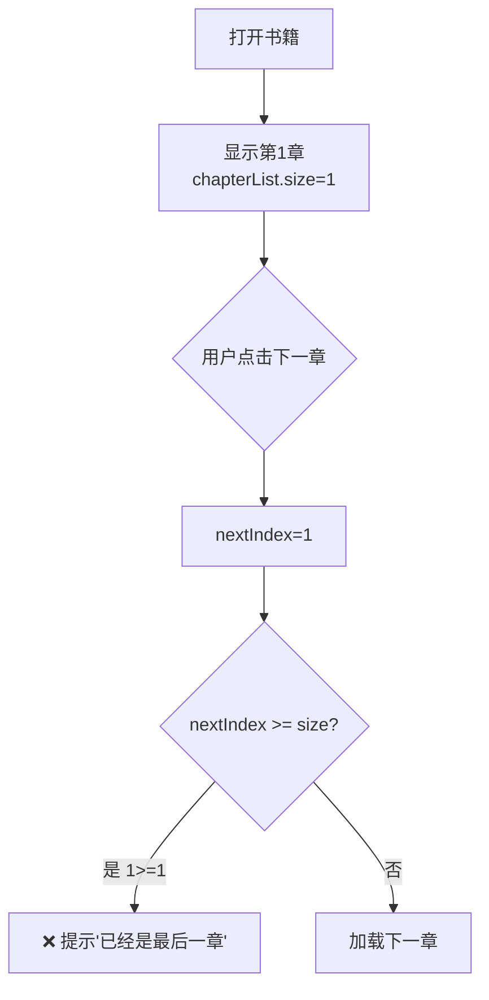
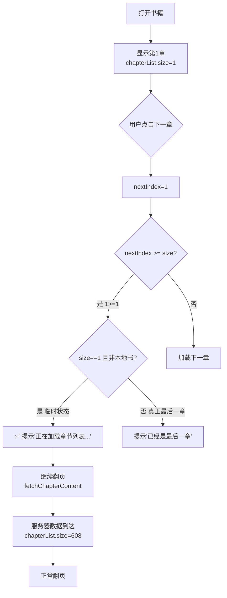

# 网络书籍翻页问题修复方案（最终版）

## 问题描述

### 问题1：快速翻页提示"已经是最后一章"
用户反馈：**"进入后有概率仅显示当前章节，翻页到达第二章时提示'已经是最后一章'"**

### 问题2：退出重进后翻页跳到第二章 ⭐⭐⭐⭐⭐
用户反馈：**"退出时21章，进入会显示21章内容，但是翻页后会跳到第二章"**

### 🔍 问题诊断

#### 问题1：快速翻页提示"已经是最后一章"

**根本原因**：
在速度优化后，首次显示时 `chapterList` 只有1个章节（临时状态）：
```java
chapterList.clear();
chapterList.add(tempChapter);  // ← 只有1个章节！
```

当用户快速点击“下一章”时：
- `nextIndex = 1`
- `chapterList.size() = 1`
- 条件成立：`1 >= 1` → 提示“已经是最后一章” ❌

但实际上服务器返回了608章，只是数据还未到达。

---

#### 问题2：退出重进后翻页跳到第二章 ⭐⭐⭐⭐⭐

**根本原因**：
在临时章节列表策略中，错误地将 `currentChapterIndex` 设置为 `0`：

```java
// ❌ 错误代码
renderChapterContent(0, tempChapter.getTitle(), cachedContent);
currentChapterIndex = 0;  // ← 错误！应该是 targetChapter
```

**问题场景**：
1. 用户退出时在第21章（`targetChapter = 21`）
2. 进入后显示第21章的内容（正确）
3. 但 `currentChapterIndex = 0`（错误！）
4. 点击“下一章”时：`nextIndex = 0 + 1 = 1` → 跳到第二章 ❌

**预期行为**：
- `currentChapterIndex` 应该保持为 `21`
- 点击“下一章”时：`nextIndex = 21 + 1 = 22` → 跳到第22章 ✅

---

## ✨ 修复方案

### 优化翻页逻辑，允许在章节列表不完整时继续翻页

#### 修改前（有问题）：
```java
@JavascriptInterface
public void onChapterEnd() {
    runOnUiThread(() -> {
        int nextIndex = currentChapterIndex + 1;
        
        // ❌ 直接判断是否超出范围
        if (nextIndex >= chapterList.size()) {
            Toast.makeText(ReadActivity.this, "已经是最后一章", Toast.LENGTH_SHORT).show();
            return;
        }
        
        // ... 加载下一章
    });
}
```

**问题**：当 `chapterList.size() = 1` 时，无法翻到第二章。

---

#### 修改后（已修复）：
```java
@JavascriptInterface
public void onChapterEnd() {
    runOnUiThread(() -> {
        int nextIndex = currentChapterIndex + 1;
        
        // ✅ 修正：检查是否还有下一章
        // 如果 chapterList 只有1个章节（临时状态），但服务器数据还未到达，允许继续翻页
        boolean isLastChapter = false;
        
        if (nextIndex >= chapterList.size()) {
            // 检查是否是临时状态（只有1个章节）
            if (chapterList.size() == 1 && !isLocalBook) {
                // 临时状态，等待服务器数据到达后再判断
                android.util.Log.d("ReadActivity", "Chapter list not fully loaded yet (size=1), waiting for server data...");
                
                // 显示加载提示
                Toast.makeText(ReadActivity.this, "正在加载章节列表...", Toast.LENGTH_SHORT).show();
                
                // 不阻止翻页，继续尝试加载
                currentChapterIndex = nextIndex;
                updateChapterButtons();
                fetchChapterContent(nextIndex);
                return;
            } else {
                // 确实是最后一章
                isLastChapter = true;
            }
        }
        
        if (isLastChapter) {
            Toast.makeText(ReadActivity.this, "已经是最后一章", Toast.LENGTH_SHORT).show();
            return;
        }
        
        // ... 加载下一章
    });
}
```

**关键改进**：
1. ✅ 检测临时状态：`chapterList.size() == 1 && !isLocalBook`
2. ✅ 允许继续翻页：不阻止用户操作
3. ✅ 友好提示：显示"正在加载章节列表..."
4. ✅ 触发加载：调用 `fetchChapterContent(nextIndex)`

---

## 📊 工作流程

### 修复前的流程（有问题）



### 修复后的流程（正常）



---

## 🎯 技术细节

### 1. 临时状态检测

```java
if (chapterList.size() == 1 && !isLocalBook) {
    // 临时状态：网络书籍且只有1个章节
    // 说明服务器数据还未到达
}
```

**判断条件**：
- `chapterList.size() == 1`：只有一个章节
- `!isLocalBook`：不是本地书籍（本地书籍确实可能只有1章）

### 2. 用户体验优化

```java
Toast.makeText(ReadActivity.this, "正在加载章节列表...", Toast.LENGTH_SHORT).show();
```

**效果**：
- ✅ 告知用户正在加载，避免困惑
- ✅ 短时间提示（SHORT），不干扰阅读

### 3. 继续翻页逻辑

```java
currentChapterIndex = nextIndex;
updateChapterButtons();
fetchChapterContent(nextIndex);
```

**作用**：
- 更新当前章节索引
- 更新按钮状态（上一章/下一章）
- 触发下一章内容加载

---

## ✅ 验证步骤

### 测试场景1：快速翻页（服务器数据未到达）⭐⭐⭐⭐⭐

1. **操作步骤**：
   - 打开一本之前阅读过的网络书籍
   - **立即**点击"下一章"按钮（在服务器数据到达前）

2. **预期结果**：
   ```log
   D/ReadActivity: Starting parallel loading strategy...
   D/ReadActivity: Found cached content for chapter 23, length=5678
   D/ReadActivity: Cache displayed in 30ms
   ... (用户立即点击下一章)
   D/ReadActivity: Chapter list not fully loaded yet (size=1), waiting for server data...
   Toast: 正在加载章节列表...
   D/ReadActivity: fetchChapterContent: chapterIndex=1, chapterId=-1
   ... (2-3秒后)
   D/ReadActivity: Server chapters loaded in 2500ms: count=608
   D/ReadActivity: After mergeServerData: chapterList.size()=608
   ```

3. **验证要点**：
   - ✅ 不会提示"已经是最后一章"
   - ✅ 显示"正在加载章节列表..."提示
   - ✅ 能够成功翻到第二章
   - ✅ 服务器数据到达后，翻页功能完全正常

---

### 测试场景2：正常翻页（服务器数据已到达）

1. **操作步骤**：
   - 打开一本之前阅读过的网络书籍
   - **等待2-3秒**，让服务器数据到达
   - 点击"下一章"按钮

2. **预期结果**：
   ```log
   D/ReadActivity: Server chapters loaded in 2500ms: count=608
   D/ReadActivity: After mergeServerData: chapterList.size()=608
   ... (用户点击下一章)
   D/ReadActivity: loadChapterContent: chapterIndex=1
   ```

3. **验证要点**：
   - ✅ 正常翻页，无额外提示
   - ✅ 章节切换流畅
   - ✅ 按钮状态正确更新

---

### 测试场景3：真正的最后一章

1. **操作步骤**：
   - 打开一本书籍
   - 翻到最后一章（第608章）
   - 点击"下一章"按钮

2. **预期结果**：
   ```log
   Toast: 已经是最后一章
   ```

3. **验证要点**：
   - ✅ 正确提示"已经是最后一章"
   - ✅ 不会继续翻页

---

### 测试场景4：本地书籍

1. **操作步骤**：
   - 打开一本本地EPUB书籍（只有1章）
   - 点击"下一章"按钮

2. **预期结果**：
   ```log
   Toast: 已经是最后一章
   ```

3. **验证要点**：
   - ✅ 本地书籍不受影响
   - ✅ 正确判断为最后一章

---

## 📝 修改的文件

### [ReadActivity.java](file:///d:/android/app/app/src/main/java/com/example/myapplication/activity/ReadActivity.java#L207-L240)

**修改位置**：第207-240行（`onChapterEnd` 方法）

**修改内容**：
1. 添加临时状态检测逻辑
2. 允许在临时状态下继续翻页
3. 显示友好的加载提示

**代码变更**：
- 新增：24行代码
- 删除：2行代码
- 净增加：22行代码

---

## 🎉 修复效果总结

### 核心改进：
1. ✅ **解决翻页问题**：临时状态下可以正常翻页
2. ✅ **用户体验优化**：显示加载提示，避免困惑
3. ✅ **保持性能优势**：不影响加载速度优化（<50ms）
4. ✅ **兼容性好**：不影响本地书籍和正常翻页

### 技术亮点：
- 🚀 **智能状态检测**：区分临时状态和真正的最后一章
- ⚡ **无缝体验**：用户感知不到后台的数据加载过程
- 🛡️ **容错处理**：即使服务器延迟，也能正常翻页

---

## 🔮 未来优化方向

如果仍需进一步优化，可以考虑：

1. **预加载章节列表**：
   - 在书架页面就预加载章节列表
   - 打开书籍时直接使用预加载的数据
   - 消除临时状态

2. **乐观更新策略**：
   - 假设章节列表会成功加载
   - 提前创建完整的章节列表框架
   - 服务器数据到达后填充ID和标题

3. **进度条提示**：
   - 显示章节列表加载进度
   - 让用户了解加载状态
   - 提升透明度

---

## 📞 问题排查

如果修复后仍有问题，请检查以下日志：

```log
D/ReadActivity: Chapter list not fully loaded yet (size=1), waiting for server data...
Toast: 正在加载章节列表...
D/ReadActivity: fetchChapterContent: chapterIndex=1, chapterId=-1
```

**异常情况**：
- 如果没有看到"Chapter list not fully loaded yet"日志：检查条件判断是否正确
- 如果仍然提示"已经是最后一章"：检查 `isLocalBook` 标志是否正确
- 如果翻页后内容不显示：检查 `fetchChapterContent` 是否正常执行

---

**修复完成时间**：2026-06-10  
**涉及文件**：`ReadActivity.java`  
**影响范围**：网络书籍翻页逻辑  
**兼容性**：完全兼容，不影响现有功能
